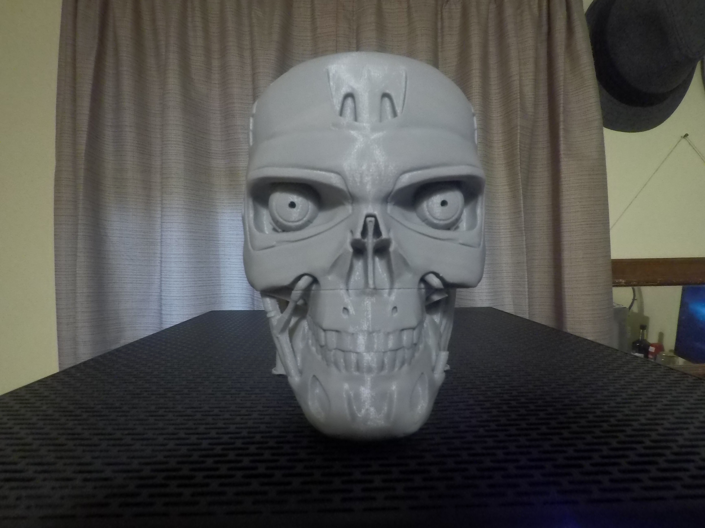
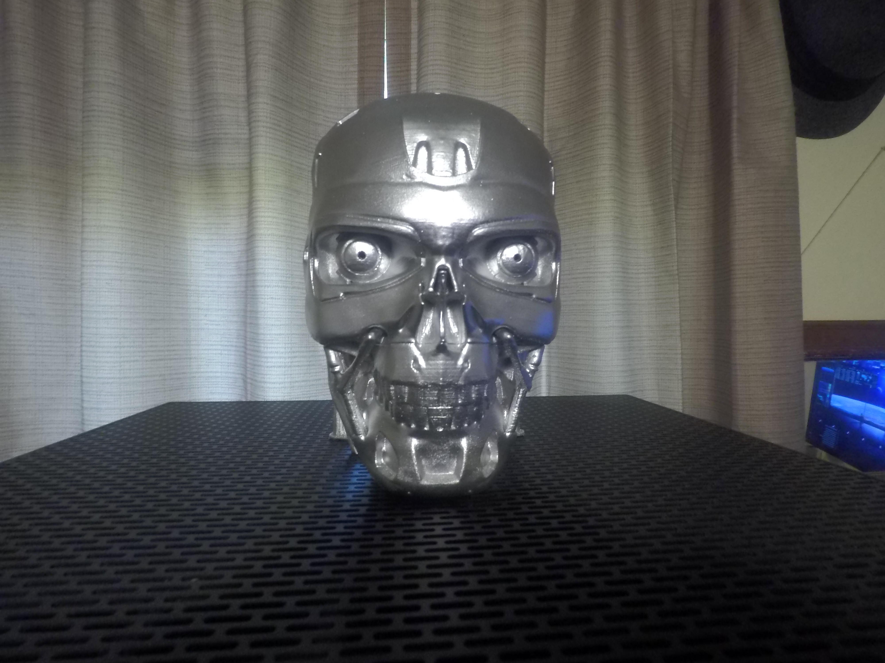
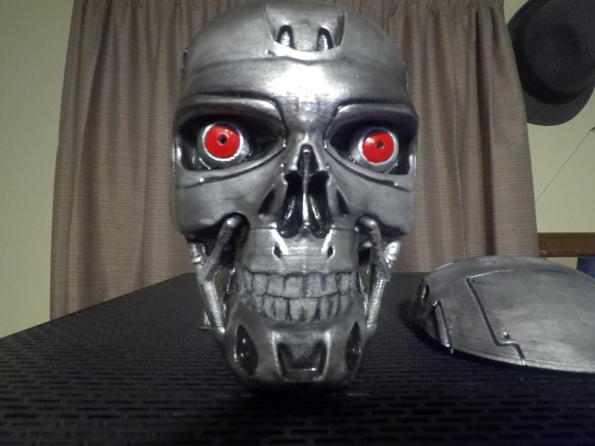
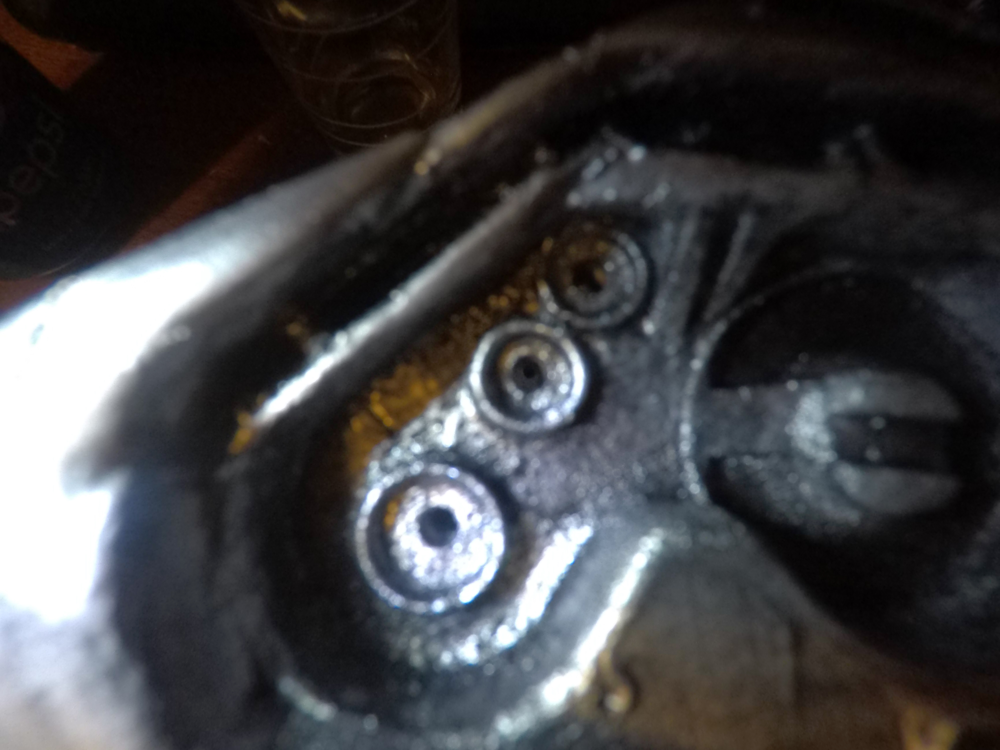
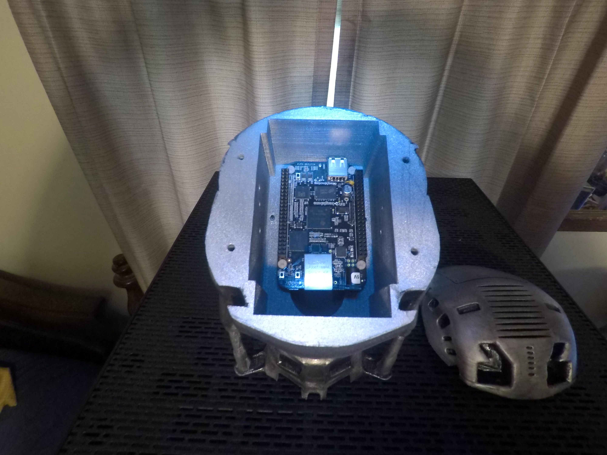

The STL files were originally downloaded from somewhere on Thingiverse. I used blender to modify them for
mounting a Beaglebone Black inside the head, I hand drilled 3 holse for the user leds in each temple,
the holse for the eyes are ruffly 3mm, so if you want to use the bigger 5mm LED's like i have you will
need to open them up.

the 4 hols between the top and middle pieces of the head are for pins so you can remove the top allowing access
to the Beaglebone, also there is room to moune a 50 x 50 x 15 12v fan wich will be activated by a relay

the bolt patern for the beaglebone was marked holding the Beaglebone in place, then installing 3/8 inch plastic
standoffs on the Beaglebone, I drilled the holes and dry fitted everything to be sure the standoffs fit nicely
(had to open up a few of them).

I applied a liberal amount of model glue to them and installed the Beaglebone, allowing several hours for the
glue to dry before removing the Beaglebone, I applied more glue making sure the standoffs were firmly fixed in
place.

This project is not perfect and it did require a lot of hand work to clean everything up nicely but my patience
payed off. How I moved the User LED's to GPIO pins is documented with a step by step guide as it was not for
the beginner and requires modifying and compiling a few files along with creating an overlay wich will free up
the pins to be used used. 

<b>Warining</b>: the user led's pins can not be used to light up a LED directly, you will damage your Beaglebone, You
will need to use an IC chip like ULN2003 to lite the LED's for you, also mentioned in the documents for moving
the User LED's to GPIO pins.

